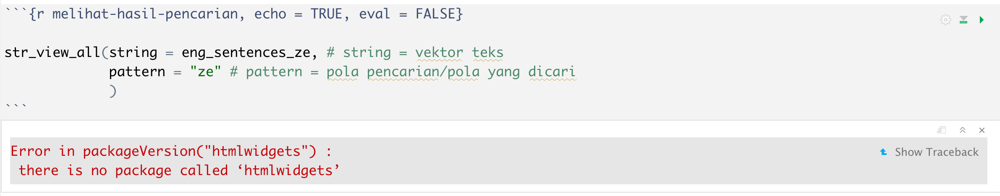

<style>
p.comment {
background-color: #E5FFCC;
padding: 10px;
border: 1px solid black;
margin-left: 25px;
border-radius: 5px;
}
</style>


<a rel="license" href="http://creativecommons.org/licenses/by-nc-sa/4.0/"></a><br /><i>The materials in this R Markdown Notebook are licensed under a <a rel="license" href="http://creativecommons.org/licenses/by-nc-sa/4.0/">Creative Commons Attribution-NonCommercial-ShareAlike 4.0 International License</a></i>.

# Pengantar {.unnumbered}

Materi pada R Markdown Notebook ini dibawakan pada [*R-Ladies Jakarta 15*^*th*^ *meetup*](https://udayananetworking.unud.ac.id/lecturer/gallery/photo/880-gede-primahadi-wijaya-rajeg/1318) (2 April 2022, 1400-1600 WIB) dengan tema *Basic text manipulation with `stringr`* [@rajeg_pengolahan_2022]. Jika materi ini digunakan kembali, menjadi dasar, ataupun dikutip untuk keperluan lokakarya dan hal-hal lainnya, mohon mengutip materi ini sebagai berikut:

> Rajeg, Gede Primahadi Wijaya. 2022. Pengolahan teks dasar dengan R menggunakan stringr. *Open Science Framework (OSF)*. doi: [10.17605/OSF.IO/9ZHDJ](https://doi.org/10.17605/OSF.IO/9ZHDJ). https://osf.io/9zhdj/ (2 April, 2022).

Pembaca disarankan mempelajari langsung dua sumber utama terkait `stringr`, yaitu (i) buku teks oleh Wickham dan Grolemund [-@wickham_r_2017], utamanya [Bab 14](https://r4ds.had.co.nz/strings.html), dan (ii) [*cheatsheet*](https://github.com/rstudio/cheatsheets/blob/main/strings.pdf) PDF untuk fungsi-fungsi kunci dalam `stringr`.

# Persiapan

```{r setup, message = FALSE, echo = TRUE}
# global option chunck
knitr::opts_chunk$set(echo = TRUE)
```

    # install package stringr jika belum terinstall
    install.packages("stringr")

Aktifkan modul/package `stringr`.

```{r aktifkan-modul-stringr, echo = TRUE}
# load the packages
library(stringr)
```

Muat data kalimat.

```{r muat-data-kalimat-stringr-semua, echo = TRUE}
eng_sentence_all <- scan(file = "data/eng_stringr_sentences_all.txt", what = "char", sep = "\n", quiet = TRUE)

length(eng_sentence_all) # ada 720 elemen kalimat

sample(eng_sentence_all, size = 3) # tampilkan 3 kalimat acak saja
```

```{r muat-data-ly, echo = TRUE}
eng_sentence_ly <- scan(file = "data/eng_sentences_ly.txt", what = "char", sep = "\n", quiet = TRUE)

sample(eng_sentence_ly, size = 3)
```

```{r muat-data-ze, echo = TRUE}
eng_sentence_ze <- scan(file = "data/eng_sentences_ze.txt", what = "char", sep = "\n", quiet = TRUE)

sample(eng_sentence_ze, size = 3)
```

```{r muat-data-kata, echo = TRUE}
words <- stringr::words # data kata (*words*) dari package stringr
sample(words, size = 3)
```

```{r muat-data-nama-buah, echo = TRUE}
fruits <- stringr::fruit # data kata-kata nama buah (*fruits*) dari package stringr
sample(fruits, size = 3)
```

# Pencarian dan pendeteksian (rangkaian) karakter

## Menguji pola pencarian dan hasil yang ditangkap dengan `str_view_all()`

Fungsi `str_view_all()` memerlukan kita menginstall package `htmlwidgets`. Jika tidak, error akan muncul seperti pada gambar di bawah ini.

```{r error-html-widget, echo = FALSE}

```

```{r install-htmlwidgets, echo = TRUE, eval = FALSE}
# install htmlwidgets package
install.packages("htmlwidgets")
```

Kode berikut mencoba menampilkan keberadaan rangkaian karakater `"ze"` dalam vektor teks `eng_sentence_all`.

```{r melihat-hasil-pencarian, echo = TRUE, message = FALSE}
str_view_all(string = eng_sentence_all, pattern = "ze", match = TRUE)
```

### Latihan {.unnumbered}

1.  Ubah parameter argumen `match = TRUE` menjadi `match = FALSE`, lalu jalankan kode sebelumnya dengan pola pencarian `"ze"`. Apa yang terjadi pada luarannya? Apa fungsi dari `match = FALSE`?
2.  Gunakan `str_view_all()` untuk menampilkan rangkaian karakter `"ly"` pada vektor teks `eng_sentence_all`.
3.  Bagaimana pola pencarian untuk menampilkan rangkaian karakter `"ly"` yang diikuti dengan spasi (*whitespace*)?

## Mendeteksi keberadaan pola rangkaian karakter dengan `str_detect()`

Fungsi `str_detect()` menghasilkan luaran logis `TRUE` dan `FALSE` yang menyatakan apakah rangkaian karakter yang kita cari ditemukan (`TRUE`) atau tidak (`FALSE`) pada suatu vektor teks/karakter.

```{r deteksi-pola-pencarian}
# buat 50 sampel kalimat sederhana
eng_sentence_all_sample <- sample(x = eng_sentence_all, size = 50)

# apakah rangkaian karakter "ed" ditemukan dalam `eng_sentence_all_sample`?
str_detect(string = eng_sentence_all_sample, pattern = "ed")
```

### Latihan {.unnumbered}

1.  Gunakan `str_view_all()` untuk menampilkan rangkaian karakter `"ed"` pada vektor teks `eng_sentence_all_sample`.
2.  Apakah rangkaian karakter konsonan `"ck"` ditemukan dalam nama-nama buah pada vektor teks `fruits`?
    -   Jika ya, gunakan `str_view_all()` untuk menampilkan nama buah apa yang mengandung rangkaian karakter konsonan `"ck"` pada vektor teks `fruits`.

------------------------------------------------------------------------

Fungsi `str_detect()` juga dapat digunakan untuk menyaring observasi yang diinginkan dalam tabel (*data frame*) berdasarkan rangkaian karakter tertentu. Ini dimungkinkan karena luaran `str_detect()` berupa struktur logis `TRUE` dan `FALSE` yang menjadi landasan dalam menyaring observasi, salah satunya dalam tabel.

```{r muat-data-tabel}
# muat data tabel hanya kolom 4 - 7
verbs_idn <- read.table(file = "data/verb_semantics.txt", header = TRUE, sep = "\t")[4:7]

# lihat enam baris pertama
head(verbs_idn)
```

Kode berikut menyaring observasi (`subset()`) dalam tabel data `verbs_idn` berdasarkan apakah kolom `example_target` mengandung teks (yaitu kata kerja *ber-*) dengan rangkaian karakter `"da"`.

```{r saring-observasi}
subset(verbs_idn, str_detect(string = example_target, pattern = "da"))
```

### Latihan {.unnumbered}

1.  Ubah kode sebelumnya untuk menyaring/mendeteksi kata-kata dalam kolom **`example_source`** yang mengandung rangkaian karakter `"ar"`.

## Menyaring elemen vektor teks yang mengandung rangkaian karakter tertentu dengan `str_subset()`

Berbeda dengan `str_detect()`, yang mengeluarkan `TRUE` dan `FALSE`, `str_subset()` (i) mendeteksi *dan* (ii) mengeluarkan elemen dalam vektor teks yang mengandung rangkaian karakter yang dicari.

```{r saring-kalimat-dengan-karakter-ing}
str_subset(string = eng_sentence_all_sample, pattern = "ing")
```
Tentu kita bisa simpan hasil penyaringan ini ke vektor lain.

```{r saring-kalimat-dengan-karakter-ing-simpan}
# simpan luaran kode berikut ke vektor `ing_output`
ing_output <- str_subset(string = eng_sentence_all_sample, pattern = "ing")
ing_output
```


### Latihan {.unnumbered}

1. Buah apa yang namanya mengandung karakter `"ck"`? Gunakan `str_subset()` untuk menjawab pertanyaan ini.
1. Gunakan `str_subset()` untuk menyaring kalimat dalam vektor `eng_sentence_all` yang mengandung rangkaian karakter `"who"`. Apakah pola pencarian `"who"` ini mengeluarkan kalimat yang mengandung kata *who* 'siapa' dalam bahasa Inggris?


<p class="comment">**Catatan tentang _regular expressions_**<br><i>[Regular expressions](https://www.regular-expressions.info/tutorial.html)</i> (RegEx) adalah pola pencarian karakter yang lebih canggih dan fleksibel yang perlu dipelajari untuk pengolahan dan manipulasi teks tingkat lanjut [lihat @wickham_r_2017, sub-bagian 14.3 untuk ulasan lebih rinci]. Salah satu jenis ReGex yang penting diketahui adalah pewatas rangkaian karakter (*anchor character*): awal (`"^"`) atau akhir (`"$"`) karakter, dan pewatas kata (*word boundary*) (`"\\b"`). <br><br>Untuk kasus pencarian rangkaian karakter `"who"` sebelumnya, kita melakukan pencarian dengan rangkaian karakter tanpa RegEx karena kita tidak memperinci bahwa karakter `"who"` yang kita inginkan adalah kata _who_ bukannya rangkaian karakter `"who"` yang bisa muncul dalam kata _**who**le_, _**who**ever_, dll. Untuk itu, pola pencarian kita untuk "kata" _who_ (bukan rangkaian karakter `"who"`) haruslah lebih spesifik dan karakter RegEx pewatas kata (`"\\b"`) dapat membantu dalam hal ini, yaitu `"\\bwho\\b"`. <br><br>Bandingkan luaran kedua baris kode berikut untuk pola pencarian dengan dan tanpa RegEx pewatas kata:</p>

```{r literal-search}
# tanpa regex pewatas kata "\\b" di kedua sisi karakter yang dicari
str_subset(string = eng_sentence_all, pattern = "who") 

# tanpa regex pewatas kata "\\b" di kedua sisi karakter yang dicari
str_view_all(string = eng_sentence_all, pattern = "who", match = TRUE)
```
```{r word-boundary-search}
# dengan regex pewatas kata "\\b" di kedua sisi karakter yang dicari
str_subset(string = eng_sentence_all, pattern = "\\bwho\\b") 

# dengan regex pewatas kata "\\b" di kedua sisi karakter yang dicari
str_view_all(string = eng_sentence_all, pattern = "\\bwho\\b", match = TRUE)
```


### Latihan {-}

1. Gunakan RegEx pewatas kata (`"\\b"`) dengan `str_subset()` untuk menyaring kalimat dalam vektor `eng_sentence_all` yang mengandung kata-kata yang **diakhiri** dengan rangkaian karakter `"ing"` (misalnya, kata-kata seperti _text**ing**_, _liv**ing**_, _r**ing**_, _spr**ing**_, dll.)
1. Gunakan `str_subset()` dan pola pencarian dengan RegEx pewatas kata (`"\\b"`) untuk mengeluarkan kata-kata yang **diawali** dengan karakter `"ch"` (misalnya _**ch**ance_, _**ch**ap_, dll.) dalam vektor teks `words`.

# Mengeluarkan (*extract*) pola karakter dari dalam teks

Fungsi `str_extract_all()` digunakan untuk "mengeluarkan" (*extract*) pola yang ditangkap dari pencarian karakter yang kita rancang. Sebagai contoh, vektor kalimat `eng_sentence_all` terdapat sejumlah nama-nama warna bahasa Inggris dan kita hanya ingin mengeluarkan kata-kata yang mencerminkan nama warna tersebut (tidak kata-kata lainnya dalam kalimat). Kita memerlukan karakter RegEx bernama "alternatif" (`|`) yang berarti 'atau'. Jika kita ingin mencari warna `"x"` **atau** `"y"` **atau** `"z"`, maka pola pencarian kita adalah `"(x|y|z)"`.

Pertama kita rampingkan data kalimat `eng_sentence_all` dengan menyaring hanya kalimat-kalimat yang mengandung nama-nama warna.

```{r ekstraksipertama}
# buat vektor karakter untuk regex pencarian dengan teknik "alternatif"
colour_pattern <- "(blue|orange|yellow|green|purple)" 

# deteksi dan saring terlebih dahulu hanya kalimat yang berisi nama-nama warna "biru", "oranye", "kuning", "hijau", dan "ungu".
sent_colour <- str_subset(string = eng_sentence_all, pattern = colour_pattern)

# cari tahu berapa kalimat yang mengandung nama-nama warna
length(sent_colour) # 20 kalimat mengandung nama-nama warna tersebut
```

Baru kita keluarkan kata-kata nama warna dari vektor karakter `sent_colour` dan simpan luarannya ke vektor karakter lainnya dengan nama `word_colour`.

```{r ekstraksikedua}
# keluarkan nama-nama warna dari vektor `sent_colour` dan simpan ke vektor `word_colour`
word_colour <- str_extract_all(string = sent_colour, pattern = colour_pattern) 

# lihat enam elemen pertama
head(word_colour) # luaran berupa List bukan Vektor karakter (atomis)
```

```{r ekstraksiketiga}
word_colour_vector <- unlist(word_colour) # unlist menjadi vektor karakter
word_colour_vector
```

Gunakan `str_sort()` untuk mengurutkan karakter secara alfabetis.

```{r}
str_sort(word_colour_vector)
```

Kita bisa gunakan `table()` untuk mentabulasi karakter vektor nama warna untuk mengetahui distribusi/frekuensi kemunculan warna tersebut.

```{r tabulasi-warna}
table(word_colour_vector)
```

# Memecah teks menjadi unit yang lebih kecil

to be updated

# Mengubah komponen teks (*find and replace*)

to be updated

# Daftar acuan
