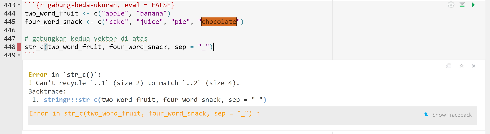

<style>

  p.comment {
  background-color: #E5FFCC;
  padding: 10px;
  border: 1px solid black;
  margin-left: 25px;
  border-radius: 5px;
}

</style>


<a rel="license" href="http://creativecommons.org/licenses/by-nc-sa/4.0/"></a> [![DOI](https://img.shields.io/badge/doi-10.6084/m9.figshare.21579513-blue.svg?style=flat&labelColor=whitesmoke&logo=data%3Aimage%2Fpng%3Bbase64%2CiVBORw0KGgoAAAANSUhEUgAAAB8AAAAfCAYAAAAfrhY5AAAJsklEQVR42qWXd1DTaRrHf%2BiB2Hdt5zhrAUKz4IKEYu9IGiGFFJJQ0gkJCAKiWFDWBRdFhCQUF3UVdeVcRQEBxUI3yY9iEnQHb3bdW1fPubnyz%2F11M7lvEHfOQee2ZOYzPyDv%2B3yf9%2Fk95YX4fx%2BltfUt08GcFEuPR4U9hDDZ%2FVngIlhb%2FSiI6InkTgLzgDcgfvtnovhH4BzoVlrbwr55QnhCtBW4QHXnFrZbPBaQoBh4%2FSYH2EnpBEtqcDMVzB93wA%2F8AFwa23XFGcc8CkT3mxz%2BfXWtq9T9IQlLIXYEuHojudb%2BCM7Hgdq8ydi%2FAHiBXyY%2BLjwFlAEnS6Jnar%2FvnQVhvdzasad0eKvWZKe8hvDB2ofLZ%2FZEcWsh%2BhyIuyO5Bxs2iZIE4nRv7NWAb0EO8AC%2FWPxjYAWuOEX2MSXZVgPxzmRL3xKz3ScGpx6p6QnOx4mDIFqO0w6Q4fEhO5IzwxlSwyD2FYHzwAW%2BAZ4fEsf74gCumykwNHskLM7taQxLYjjIyy8MUtraGhTWdkfhkFJqtvuVl%2F9l2ZquDfEyrH8B0W06nnpH3JtIyRGpH1iJ6SfxDIHjRXHJmdQjLpfHeN54gnfFx4W9QRnovx%2FN20aXZeTD2J84hn3%2BqoF2Tqr14VqTPUCIcP%2B5%2Fly4qC%2BUL3sYxSvNj1NwsVYPsWdMUfomsdkYm3Tj0nbV0N1wRKwFe1MgKACDIBdMAhPE%2FwicwNWxll8Ag40w%2BFfhibJkGHmutjYeQ8gVlaN%2BjO51nDysa9TwNUFMqaGbKdRJZFfOJSp6mkRKsv0rRIpEVWjAvyFkxNOEpwvcAVPfEe%2Bl8ojeNTx3nXLBcWRrYGxSRjDEk0VlpxYrbe1ZmaQ5xuT0u3r%2B2qe5j0J5uytiZPGsRL2Jm32AldpxPUNJ3jmmsN4x62z1cXrbedXBQf2yvIFCeZrtyicZZG2U2nrrBJzYorI2EXLrvTfCSB43s41PKEvbZDEfQby6L4JTj%2FfIwam%2B4%2BwucBu%2BDgNK05Nle1rSt9HvR%2FKPC4U6LTfvUIaip1mjIa8fPzykii23h2eanT57zQ7fsyYH5QjywwlooAUcAdOh5QumgTHx6aAO7%2FL52eaQNEShrxfhL6albEDmfhGflrsT4tps8gTHNOJbeDeBlt0WJWDHSgxs6cW6lQqyg1FpD5ZVDfhn1HYFF1y4Eiaqa18pQf3zzYMBhcanlBjYfgWNayAf%2FASOgklu8bmgD7hADrk4cRlOL7NSOewEcbqSmaivT33QuFdHXj5sdvjlN5yMDrAECmdgDWG2L8P%2BAKLs9ZLZ7dJda%2BB4Xl84t7QvnKfvpXJv9obz2KgK8dXyqISyV0sXGZ0U47hOA%2FAiigbEMECJxC9aoKp86re5O5prxOlHkcksutSQJzxZRlPZmrOKhsQBF5zEZKybUC0vVjG8PqOnhOq46qyDTDnj5gZBriWCk4DvXrudQnXQmnXblebhAC2cCB6zIbM4PYgGl0elPSgIf3iFEA21aLdHYLHUQuVkpgi02SxFdrG862Y8ymYGMvXDzUmiX8DS5vKZyZlGmsSgQqfLub5RyLNS4zfDiZc9Edzh%2FtCE%2BX8j9k%2FqWB071rcZyMImne1SLkL4GRw4UPHMV3jjwEYpPG5uW5fAEot0aTSJnsGAwHJi2nvF1Y5OIqWziVCQd5NT7t6Q8guOSpgS%2Fa1dSRn8JGGaCD3BPXDyQRG4Bqhu8XrgAp0yy8DMSvvyVXDgJcJTcr1wQ2BvFKf65jqhvmxXUuDpGBlRvV36XvGjQzLi8KAKT2lYOnmxQPGorURSV0NhyTIuIyqOmKTMhQ%2BieEsgOgpc4KBbfDM4B3SIgFljvfHF6cef7qpyLBXAiQcXvg5l3Iunp%2FWv4dH6qFziO%2BL9PbrimQ9RY6MQphEfGUpOmma7KkGzuS8sPUFnCtIYcKCaI9EXo4HlQLgGrBjbiK5EqMj2AKWt9QWcIFMtnVvQVDQV9lXJJqdPVtUQpbh6gCI2Ov1nvZts7yYdsnvRgxiWFOtNJcOMVLn1vgptVi6qrNiFOfEjHCDB3J%2BHDLqUB77YgQGwX%2Fb1eYna3hGKdlqJKIyiE4nSbV8VFgxmxR4b5mVkkeUhMgs5YTi4ja2XZ009xJRHdkfwMi%2BfocaancuO7h%2FMlcLOa0V%2FSw6Dq47CumRQAKhgbOP8t%2BMTjuxjJGhXCY6XpmDDFqWlVYbQ1aDJ5Cptdw4oLbf3Ck%2BdWkVP0LpH7s9XLPXI%2FQX8ws%2Bj2In63IcRvOOo%2BTTjiN%2BlssfRsanW%2B3REVKoavBOAPTXABW4AL7e4NygHdpAKBscmlDh9Jysp4wxbnUNna3L3xBvyE1jyrGIkUHaqQMuxhHElV6oj1picvgL1QEuS5PyZTEaivqh5vUCKJqOuIgPFGESns8kyFk7%2FDxyima3cYxi%2FYOQCj%2F%2B9Ms2Ll%2Bhn4FmKnl7JkGXQGDKDAz9rUGL1TIlBpuJr9Be2JjK6qPzyDg495UxXYF7JY1qKimw9jWjF0iV6DRIqE%2B%2FeWG0J2ofmZTk0mLYVd4GLiFCOoKR0Cg727tWq981InYynvCuKW43aXgEjofVbxIqrm0VL76zlH3gQzWP3R3Bv9oXxclrlO7VVtgBRpSP4hMFWJ8BrUSBCJXC07l40X4jWuvtc42ofNCxtlX2JH6bdeojXgTh5TxOBKEyY5wvBE%2BACh8BtOPNPkApjoxi5h%2B%2FFMQQNpWvZaMH7MKFu5Ax8HoCQdmGkJrtnOiLHwD3uS5y8%2F2xTSDrE%2F4PT1yqtt6vGe8ldMBVMEPd6KwqiYECHDlfbvzphcWP%2BJiZuL5swoWQYlS%2Br7Yu5mNUiGD2retxBi9fl6RDGn4Ti9B1oyYy%2BMP5G87D%2FCpRlvdnuy0PY6RC8BzTA40NXqckQ9TaOUDywkYsudxJzPgyDoAWn%2BB6nEFbaVxxC6UXjJiuDkW9TWq7uRBOJocky9iMfUhGpv%2FdQuVVIuGjYqACbXf8aa%2BPeYNIHZsM7l4s5gAQuUAzRUoT51hnH3EWofXf2vkD5HJJ33vwE%2FaEWp36GHr6GpMaH4AAPuqM5eabH%2FhfG9zcCz4nN6cPinuAw6IHwtvyB%2FdO1toZciBaPh25U0ducR2PI3Zl7mokyLWKkSnEDOg1x5fCsJE9EKhH7HwFNhWMGMS7%2BqxyYsbHHRUDUH4I%2FAheQY7wujJNnFUH4KdCju83riuQeHU9WEqNzjsJFuF%2FdTDAZ%2FK7%2F1WaAU%2BAWymT59pVMT4g2AxcwNa0XEBDdBDpAPvgDIH73R25teeuAF5ime2Ul0OUIiG4GpSAEJeYW9wDTf43wfwHgHLKJoPznkwAAAABJRU5ErkJggg%3D%3D)](http://dx.doi.org/10.6084/m9.figshare.21579513) [](https://doi.org/10.17605/OSF.IO/9ZHDJ) <br /><i>The materials in this R Markdown Notebook are licensed under a <a rel="license" href="http://creativecommons.org/licenses/by-nc-sa/4.0/">Creative Commons Attribution-NonCommercial-ShareAlike 4.0 International License</a></i>.

# Pengantar {.unnumbered}

Materi pada R Markdown Notebook ini dibawakan pada [*R-Ladies Jakarta 15*^*th*^ *meetup*](https://udayananetworking.unud.ac.id/lecturer/gallery/photo/880-gede-primahadi-wijaya-rajeg/1318) (2 April 2022, 1400-1600 WIB) dengan tema *Basic text manipulation with `stringr`* [@rajeg_pengolahan_2022]. Jika materi ini digunakan kembali, menjadi dasar, ataupun dikutip untuk keperluan lokakarya dan hal-hal lainnya, mohon mengutip materi ini sebagai berikut:

> Rajeg, Gede Primahadi Wijaya (2022). Pengolahan teks dasar dengan R menggunakan stringr. figshare. Online resource. https://doi.org/10.6084/m9.figshare.21579513.v1 (2 April, 2022).

Dan juga salindia pembuka sebelum pelaksanaan lokakarya [@rajeg_basic_2022]:

> Rajeg, Gede Primahadi Wijaya. 2022. *Basic text manipulation with stringr*. OSF Preprints. doi: [10.31219/osf.io/q9yva](https://doi.org/10.31219/osf.io/q9yva). [https://osf.io/q9yva/](https://doi.org/10.31219/osf.io/q9yva) (2 April, 2022).

Pembaca disarankan mempelajari langsung dua sumber utama terkait `stringr`, yaitu (i) buku teks oleh Wickham dan Grolemund [-@wickham_r_2017], utamanya [Bab 14](https://r4ds.had.co.nz/strings.html), dan (ii) [*cheatsheet*](https://github.com/rstudio/cheatsheets/blob/main/strings.pdf) PDF untuk fungsi-fungsi kunci dalam `stringr`. Bacaan lain yang mungkin bisa dilihat adalah makalah kami [@rajeg_working_2018] yang salah satu bagiannya membahas pengolahan teks dasar menggunakan sejumlah fungsi pengolahan teks dari instalasi dasar R (bukan menggunakan `stringr`) (kode sumber makalah tersebut dapat diakses melalui [tautan berikut](https://doi.org/10.4225/03/5a7ee2ac84303) atau [berikut](https://osf.io/s6kh8/)).

# Persiapan

```{r setup}
# global option chunck
knitr::opts_chunk$set(echo = TRUE, include = TRUE, message = FALSE, warning = FALSE)
```

```
# install package stringr
install.packages("stringr")
```

Aktifkan modul/package `stringr`.

```{r aktifkan-modul-stringr}
# load the packages
library(stringr)
```

Muat data teks berupa kalimat dan kata-kata.

```{r muat-data-kalimat-stringr-semua}
eng_sentence_all <- scan(file = "data/eng_stringr_sentences_all.txt", what = "char", sep = "\n", quiet = TRUE)

length(eng_sentence_all) # ada 720 elemen kalimat

sample(eng_sentence_all, size = 3) # tampilkan 3 kalimat acak saja
```

```{r muat-data-ly, echo = FALSE, include = FALSE, eval = FALSE}
eng_sentence_ly <- scan(file = "data/eng_sentences_ly.txt", what = "char", sep = "\n", quiet = TRUE)

sample(eng_sentence_ly, size = 3)
```

```{r muat-data-ze, echo = FALSE, include = FALSE, eval = FALSE}
eng_sentence_ze <- scan(file = "data/eng_sentences_ze.txt", what = "char", sep = "\n", quiet = TRUE)

sample(eng_sentence_ze, size = 3)
```

```{r muat-data-kata}
words <- stringr::words # data kata (*words*) dari package stringr
sample(words, size = 3)
```

```{r muat-data-nama-buah}
fruits <- stringr::fruit # data kata-kata nama buah (*fruits*) dari package stringr
sample(fruits, size = 3)
```

# Pencarian dan pendeteksian (rangkaian) karakter

## Menguji pola pencarian dan hasil yang ditangkap dengan `str_view_all()`

Fungsi `str_view_all()` memerlukan kita menginstall package `htmlwidgets`. Jika tidak, error akan muncul seperti pada gambar di bawah ini.

```{r error-html-widget, echo = FALSE}
knitr::include_graphics("htmlwidget-error.png")
```

```{r install-htmlwidgets, eval = FALSE}
# install htmlwidgets package
install.packages("htmlwidgets")
```

Kode berikut mencoba menampilkan keberadaan rangkaian karakater `"ze"` dalam vektor teks `eng_sentence_all`.

```{r melihat-hasil-pencarian, message = FALSE, warning = FALSE}
str_view_all(string = eng_sentence_all, pattern = "ze", match = TRUE)
```

### Latihan {.unnumbered}

1.  Ubah parameter argumen `match = TRUE` menjadi `match = FALSE`, lalu jalankan kode sebelumnya dengan pola pencarian `"ze"`. Apa yang terjadi pada luarannya? Apa fungsi dari `match = FALSE`?
2.  Gunakan `str_view_all()` untuk menampilkan rangkaian karakter `"ly"` pada vektor teks `eng_sentence_all`.
3.  Bagaimana pola pencarian untuk menampilkan rangkaian karakter `"ly"` yang diikuti dengan spasi (*whitespace*)?

## Mendeteksi keberadaan pola rangkaian karakter dengan `str_detect()`

Fungsi `str_detect()` menghasilkan luaran logis `TRUE` dan `FALSE` yang menyatakan apakah rangkaian karakter yang kita cari ditemukan (`TRUE`) atau tidak (`FALSE`) pada suatu vektor teks/karakter.

```{r deteksi-pola-pencarian}
# buat 50 sampel kalimat sederhana
eng_sentence_all_sample <- sample(x = eng_sentence_all, size = 50)

# apakah rangkaian karakter "ed" ditemukan dalam `eng_sentence_all_sample`?
str_detect(string = eng_sentence_all_sample, pattern = "ed")
```

### Latihan {.unnumbered}

1.  Gunakan `str_view_all()` untuk menampilkan rangkaian karakter `"ed"` pada vektor teks `eng_sentence_all_sample`.
2.  Apakah rangkaian karakter konsonan `"ck"` ditemukan dalam nama-nama buah pada vektor teks `fruits`?
    -   Jika ya, gunakan `str_view_all()` untuk menampilkan nama buah apa yang mengandung rangkaian karakter konsonan `"ck"` pada vektor teks `fruits`.

------------------------------------------------------------------------

Fungsi `str_detect()` juga dapat digunakan untuk menyaring observasi yang diinginkan dalam tabel (*data frame*) berdasarkan rangkaian karakter tertentu. Ini dimungkinkan karena luaran `str_detect()` berupa struktur logis `TRUE` dan `FALSE` yang menjadi landasan dalam menyaring observasi, salah satunya dalam tabel.

```{r muat-data-tabel}
# muat data tabel hanya kolom 4 - 7
verbs_idn <- read.table(file = "data/verb_semantics.txt", header = TRUE, sep = "\t")[4:7]

# lihat enam baris pertama
head(verbs_idn)
```

Kode berikut menyaring observasi (`subset()`) dalam tabel data `verbs_idn` berdasarkan apakah kolom `example_target` mengandung teks (yaitu kata kerja *ber-*) dengan rangkaian karakter `"da"` [lihat @primahadi_metonymy_2013 untuk makalah yang dilandasi atas data tabel tersebut].

```{r saring-observasi}
subset(verbs_idn, str_detect(string = example_target, pattern = "da"))
```

### Latihan {.unnumbered}

1.  Ubah kode sebelumnya untuk menyaring/mendeteksi kata-kata dalam kolom **`example_source`** yang mengandung rangkaian karakter `"ar"`.

## Menyaring elemen vektor teks yang mengandung rangkaian karakter tertentu dengan `str_subset()`

Berbeda dengan `str_detect()`, yang mengeluarkan `TRUE` dan `FALSE`, `str_subset()` (i) mendeteksi *dan* (ii) mengeluarkan elemen dalam vektor teks yang mengandung rangkaian karakter yang dicari.

```{r saring-kalimat-dengan-karakter-ing}
str_subset(string = eng_sentence_all_sample, pattern = "ing")
```
Tentu kita bisa simpan hasil penyaringan ini ke vektor lain.

```{r saring-kalimat-dengan-karakter-ing-simpan}
# simpan luaran kode berikut ke vektor `ing_output`
ing_output <- str_subset(string = eng_sentence_all_sample, pattern = "ing")
ing_output
```


### Latihan {.unnumbered}

1. Buah apa yang namanya mengandung karakter `"ck"`? Gunakan `str_subset()` pada vektor teks `fruits` untuk menjawab pertanyaan ini.
1. Gunakan `str_subset()` untuk menyaring kalimat dalam vektor `eng_sentence_all` yang mengandung rangkaian karakter `"who"`. Apakah pola pencarian `"who"` ini mengeluarkan kalimat yang mengandung kata *who* 'siapa' dalam bahasa Inggris?

---------

<p class="comment">**Catatan tentang _regular expressions_**<br><br/><i>[Regular expressions](https://www.regular-expressions.info/tutorial.html)</i> (RegEx) adalah pola pencarian karakter yang lebih canggih dan fleksibel yang perlu dipelajari untuk pengolahan dan manipulasi teks tingkat lanjut [lihat @wickham_r_2017, sub-bagian 14.3 untuk ulasan lebih rinci].<br/><br/> Salah satu jenis ReGex yang penting diketahui adalah **pewatas rangkaian karakter yang mencerminkan kata** (*word boundary*) (`"\\b"`). Untuk kasus pencarian rangkaian karakter `"who"` sebelumnya, kita melakukan pencarian dengan rangkaian karakter tanpa RegEx karena kita tidak memperinci bahwa karakter `"who"` yang kita inginkan adalah kata _who_ bukannya rangkaian karakter `"who"` yang bisa muncul dalam kata _**who**le_, _**who**ever_, dll. Untuk itu, pola pencarian kita untuk "kata" _who_ (bukan rangkaian karakter `"who"`) haruslah lebih spesifik dan karakter RegEx pewatas kata (`"\\b"`) dapat membantu dalam hal ini, yaitu `"\\bwho\\b"`.</p>

Bandingkan luaran kedua baris kode berikut untuk pola pencarian dengan dan tanpa RegEx pewatas kata (`"\\b"`):

```{r literal-search}
# tanpa regex pewatas kata "\\b" di kedua sisi karakter yang dicari
str_subset(string = eng_sentence_all, pattern = "who") 

# tanpa regex pewatas kata "\\b" di kedua sisi karakter yang dicari
str_view_all(string = eng_sentence_all, pattern = "who", match = TRUE)
```
```{r word-boundary-search}
# dengan regex pewatas kata "\\b" di kedua sisi karakter yang dicari
str_subset(string = eng_sentence_all, pattern = "\\bwho\\b") 

# dengan regex pewatas kata "\\b" di kedua sisi karakter yang dicari
str_view_all(string = eng_sentence_all, pattern = "\\bwho\\b", match = TRUE)
```


### Latihan {-}

1. Gunakan RegEx pewatas kata (`"\\b"`) dengan `str_subset()` untuk menyaring kalimat dalam vektor `eng_sentence_all` yang mengandung kata-kata yang **diakhiri** dengan rangkaian karakter `"ing"` (misalnya, kata-kata seperti _text**ing**_, _liv**ing**_, _r**ing**_, _spr**ing**_, dll.)
1. Gunakan `str_subset()` dan pola pencarian dengan RegEx pewatas kata (`"\\b"`) untuk mengeluarkan kata-kata yang **diawali** dengan karakter `"ch"` (misalnya _**ch**ance_, _**ch**ap_, dll.) dalam vektor teks `words`.

------

<p class="comment">**Catatan tentang _regular expressions_**<br><br/>Selain pewatas rangkaian karakter berupa kata, terdapat dua lagi ReGex pewatas rangkaian karakter yang penting diketahui, yaitu **pewatas rangkaian karakter** secara umum (*anchor character*): (i) pewatas **posisi awal** rangkaian karakter (`"^"`) dan (ii) pewatas **posisi akhir** rangkaian karakter (`"$"`).</p> 

Perhatikan kode berikut sebagai contoh penggunaan RegEx pewatas awal dan akhir rangkaian karakter [dikutip dari @wickham_r_2017, 202]:

```{r end-of-string}
# buat data sederhana
fruit_mini <- c("apple", "banana", "pear")

# menangkap karakter `"a"` yang muncul di akhir (`"$"`) rangkaian karakter nama buah pada vektor `fruit_mini`
str_view_all(string = fruit_mini, pattern = "a$")
str_subset(string = fruit_mini, pattern = "a$")
```


```{r beginning-of-string}
# menangkap karakter `"a"` yang muncul di akhir (`"$"`) rangkaian karakter nama buah pada vektor `fruit_mini`
str_view_all(string = fruit_mini, pattern = "^a")
str_subset(string = fruit_mini, pattern = "^a")
```

Kita bisa menggabungkan `"^"` dan `"$"` untuk mempertegas bahwa kita hanya ingin menangkap rangkaian karakter secara utuh. Bandingkan kedua kode berikut [dikutip dari @wickham_r_2017, 202]:

```{r partial-match}
# buat data lain
fruit_cake <- c("apple pie", "apple", "apple cake")

# pencarian sederhana (tanpa RegEx) untuk menangkap rangkaian karakter `"apple"`
str_view_all(string = fruit_cake, pattern = "apple")
str_subset(string = fruit_cake, pattern = "apple")
```

```{r complete-match}
# menangkap hanya rangkaian karakter utuh dari awal hingga akhir rangkaian karakter
str_view_all(string = fruit_cake, pattern = "^apple$")
str_subset(string = fruit_cake, pattern = "^apple$")
```

### Latihan {-}

1. Buah apa saja yang namanya **diawali** dengan karakter konsonan `"b"`? Gunakan `str_subset()` untuk mengeluarkan dari vektor `fruits` nama-nama buah yang diawali dengan karakter `"b"`.

1. Ada berapa buah yang namanya **berakhir** dengan karakter vokal `"o"`? Gunakan `str_subset()` untuk mengeluarkan dari vektor `fruits` nama-nama buah yang diawali dengan karakter `"o"`.


<p class="comment">**Tips**<br><br/>`stringr` juga memiliki dua fungsi khusus untuk mendeteksi keberadaan (rangkaian) karakter yang muncul (i) **di awal** rangkaian karakter, yaitu fungsi [`str_starts()`](https://stringr.tidyverse.org/reference/str_starts.html), dan (ii) **di akhir** rangkaian karakter, yaitu fungsi [`str_ends()`](https://stringr.tidyverse.org/reference/str_starts.html). Layaknya `str_detect()`, kedua fungsi ini mengeluarkan vektor logis `TRUE` dan `FALSE`.<br/><br/>Misalnya, `str_starts(fruit_mini, "p")` akan mendeteksi adakah elemen teks dalam vektor `fruit_mini` yang diawali dengan karakter `"p"`, tanpa perlu menggunakan RegEx pewatas karakter awal `"^"`. Sebaliknya, `str_ends(fruit_mini, "p")` akan mendeteksi keberadaan teks dalam `fruit_mini` yang diakhiri dengan karakter `"p"`, tanpa perlu menggunakan RegEx pewatas karakter akhir `"$"`.<br/><br/>RegEx tetap diperlukan jika menggunakan fungsi `str_subset()` untuk menyaring teks yang diawali atau diakhiri dengan (rangkaian) karakter tertentu.</p>

------

# Mengeluarkan (*extract*) pola karakter dari dalam teks

Fungsi `str_extract_all()` digunakan untuk "mengeluarkan" (*extract*) pola yang ditangkap dari pencarian karakter yang kita rancang. Sebagai contoh, vektor kalimat `eng_sentence_all` terdapat sejumlah nama-nama warna bahasa Inggris dan kita hanya ingin mengeluarkan kata-kata yang mencerminkan nama warna tersebut (tidak kata-kata lainnya dalam kalimat). Kita memerlukan karakter RegEx bernama "alternatif" (`|`) yang berarti 'atau'. Jika kita ingin mencari warna `"x"` **atau** `"y"` **atau** `"z"`, maka pola pencarian kita adalah `"(x|y|z)"`.

Pertama kita rampingkan data kalimat `eng_sentence_all` dengan menyaring hanya kalimat-kalimat yang mengandung nama-nama warna.

```{r ekstraksipertama}
# buat vektor karakter untuk regex pencarian dengan teknik "alternatif"
colour_pattern <- "(blue|orange|yellow|green|purple)" 

# deteksi dan saring terlebih dahulu hanya kalimat yang berisi nama-nama warna "biru", "oranye", "kuning", "hijau", dan "ungu".
sent_colour <- str_subset(string = eng_sentence_all, pattern = colour_pattern)

# cari tahu berapa kalimat yang mengandung nama-nama warna
length(sent_colour) # 20 kalimat mengandung nama-nama warna tersebut
```

Baru kita keluarkan kata-kata nama warna dari vektor karakter `sent_colour` dan simpan luarannya ke vektor karakter lainnya dengan nama `word_colour`.

```{r ekstraksikedua}
# keluarkan nama-nama warna dari vektor `sent_colour` dan simpan ke vektor `word_colour`
word_colour <- str_extract_all(string = sent_colour, pattern = colour_pattern) 

# lihat enam elemen pertama
head(word_colour) # luaran berupa List bukan Vektor karakter (atomis)
```

```{r ekstraksiketiga}
word_colour_vector <- unlist(word_colour) # unlist menjadi vektor karakter
word_colour_vector
```

Gunakan `str_sort()` untuk mengurutkan karakter secara alfabetis.

```{r menyortir-teks-secara-alfabetis}
str_sort(word_colour_vector)
```

Kita bisa gunakan `table()` untuk mentabulasi karakter vektor nama warna untuk mengetahui distribusi/frekuensi kemunculan warna tersebut.

```{r tabulasi-warna}
table(word_colour_vector)
```

```{r sortir-tabulasi}
# sortir nama warna dari frekuensi tertinggi ke terendah
word_colour_count <- table(word_colour_vector)
word_colour_count <- sort(word_colour_count, decreasing = TRUE)
word_colour_count
```

# Memecah teks menjadi unit yang lebih kecil

Fungsi `str_split()` digunakan untuk memecah teks berdasarkan pada karakter mana teks tersebut dipecah. Contoh paling sederhana adalah memecah kalimat menjadi kata dengan memecahnya pada karakter spasi (yang merupakan pemisah kata untuk karakter Roman yang dipahami oleh komputer).

```{r pecah-teks}
# contoh sederhana pemecahan kalimat -> kata dengan dua kalimat 
two_sentences <- eng_sentence_all_sample[1:2]

# pecah teks pada karakter spasi `" "`.
str_split(two_sentences, pattern = " ") # luarannya adalah List
```

Isunya adalah tanda baca seperti titik (`.`) masih menempel pada kata yang mengakhiri kalimat. Pada situasi inilah kekuatan dari RegEx menjadi penting.

Kita perlu merancang pola pencarian RegEx yang menyatakan bahwa kita ingin memisahkan/memecah teks pada kelompok karakter **selain** kelompok karakter pembentuk kata, yaitu kelompok karakter **di luar** karakter alfanumeris dan strip `"-"`. Dalam konteks bahasa Inggris, `"-"` dipertahankan untuk menangkap kata seperti *computer-readable* sebagai satu unit, bukannya menjadi dua unit *computer* dan *readable*. 

RegEx yang bisa digunakan adalah `"[^a-zA-Z0-9-]+"`, yang artinya: satu atau lebih (`"+"`) kelompok karakter (`"[...]"`) yang bukan (`"^"`) (i) alfanumeris kapital dan kecil (`"a-zA-Z0-9"`) dan strip (`"-"`).

```{r pecah-teks-regex}
# pecah teks pada karakter non-alfanumeris dan spasi `" "`.
str_split(two_sentences, pattern = "[^a-zA-Z0-9-]+")
```

Tentu luaran List ini bisa kita ubah menjadi vektor atomis:

```{r unlist-luaran-str-split}
split_sentence <- str_split(two_sentences, pattern = "[^a-zA-Z0-9-]+")
unlist(split_sentence)
```

Pemecahan teks dari kalimat menjadi kata ini dapat dilihat dari dua perspektif:

i. **memecah** (yaitu **memisahkan** dengan **menghilangkan**) karakter **selain** alfanumeris dan strip, menggunakan `str_split()`, atau

i. **menarik** (yaitu **mengeluarkan**/**mengekstraksi**) karakter yang membangun suatu kata, yaitu karakter alfanumeris dan strip, menggunakan `str_extract_all()`.

Jika kita mengambil perspektif kedua (dengan `str_extract_all()`), maka RegEx yang digunakan sedikit berbeda, yaitu dengan menghilangkan tanda negasi ('bukan') `"^"` dalam RegEx-nya. Perhatikan kode berikut dan bandingkan dengan teliti luaran `str_extract_all()` dengan luaran `str_split()` sebelumnya.

```{r ekstrak-kata}
# perspektif kedua memecah kalimat menjadi kata
# dengan **mengkekstraksi** kata-kata
str_extract_all(two_sentences, pattern = "[a-zA-Z0-9-]+")
```

Yang membedakan luaran `str_split()` dan `str_extract_all()` di atas, khususnya dalam konteks memecah teks kalimat menjadi kata adalah:

i. luaran `str_split()` menandai penghilangan/pemecahan tanda baca, dalam hal ini titik, dengan karakter kosong (lihat karakter `""` setelah kata `"ends"` dan `"enough"`).

i. luaran `str_extract_all()` hanya akan mengeluarkan/mengekstraksi karakter yang dinyatakan dalam pola pencariannya, yaitu satu atau lebih karakter alfanumeris dan strip; tidak ada karakter kosong yang mencerminkan dalam hal ini tanda titik.

Kita yang menentukan fungsi dan luaran seperti apa yang diinginkan.


# Mengubah komponen teks

## Mengubah karakter menjadi huruf besar atau kecil

Fungsi `str_to_upper()` mengubah karakter menjadi huruf kapital dan `str_to_lower()` menjadi huruf kecil.

```{r upper-case}
# mengubah nama warna sebelumnya menjadi huruf kapital
word_colour_caps <- str_to_upper(string = word_colour_vector)
word_colour_caps
```

```{r lower-case}
# mengubah nama warna kapital menjadi huruf kecil
str_to_lower(string = word_colour_caps)
```

### Latihan {-}

1. Lihat isi vektor `two_sentences` pada konsol dan perhatikan bentuk rangkaian karakternya. Kemudian jalankan fungsi `str_to_title()` dengan input `two_sentences`. Perubahan apa yang terjadi dan apa yang dilakukan oleh `str_to_title()`?

## Mengganti komponen teks dengan karakter lain

Terkadang kita perlu mengubah komponen teks tertentu layaknya fungsi *find and replace* pada peranti seperti MS Word. Dalam stringr, kita bisa menggunakan `str_replace()` dan `str_replace_all()`. 

Varian dasar **tanpa** `..._all()`, yaitu `str_replace()`, hanya akan mengganti karakter yang **pertama kali** ditangkap oleh pola pencariannya, sedangkan karakter yang sama yang muncul setelahnya tidak akan ditangkap dan diganti.

Perhatikan kode berikut yang mencoba mengganti karakter `"e"` pada vektor `fruit_cake`.

```{r}
# lihat kembali vektor `fruit_cake`
fruit_cake
```


```{r mengganti-sederhana}
# gunakan str_replace() untuk mengganti karakter `"e"` yang ditemukan pertama dengan strip `"-"`
str_replace(string = fruit_cake, pattern = "e", replacement = "-")
```

```{r mengganti-semua}
# gunakan str_replace_all() untuk mengganti SEMUA karakter `"e"` dengan strip `"-"`
str_replace_all(string = fruit_cake, pattern = "e", replacement = "-")
```

### Latihan {-}

1. Ganti rangkaian karakter untuk kata `"apple"` pada vektor `fruit_cake` (yang berisi `"apple pie"`, `"apple"`, dan `"apple cake"`) dengan kata `"butter"`.


# Menggabungkan vektor rangkaian karakter

Untuk menggabungkan dua atau lebih rangkaian karakter, gunakan `str_c()`.

```{r gabung-sederhana}
# menggabungkan dua rangkaian karakter: "ba" dan "li"
str_c("ba", "li")
```

```{r gabung-sederhana-1}
karakter_1 <- c("b", "l", "k")
karakter_2 <- c("a", "i", "u")

# gabungkan tiga karakter dari dua vektor
str_c(karakter_1, karakter_2)
```

```{r gabung-sederhana-2}
# gabungkan dan apit tiga karakter dalam satu vektor dengan dua karakter lain yaitu "<m>"
str_c("<m>", karakter_1, "<m>")
```

Jika salah satu dari dua vektor karakter yang akan digabung memiliki jumlah elemen yang lebih sedikit, maka `str_c()` akan mengeluarkan error. Perhatikan contoh berikut.

```{r gabung-beda-ukuran, eval = FALSE, echo = FALSE}
two_word_fruit <- c("apple", "banana")
four_word_snack <- c("cake", "juice", "pie", "chocolate")

# gabungkan kedua vektor di atas
str_c(two_word_fruit, four_word_snack, sep = "_")
```

```{r error-str-c-unequal-vector, echo = FALSE}

```

Pada contoh di atas, vektor karakter `two_word_fruit` memiliki jumlah elemen yang lebih sedikit/berbeda dengan `four_word_snack` sehingga `str_c()` mengeluarkan pesan error. Pastikan jumlah elemen untuk dua vektor karakter, yang ingin digabungkan dengan `str_c()`, sama. Perhatikan perbaikan kode sebelumnya berikut ini.

```{r gabung-sama-ukuran, echo = TRUE}
four_word_fruit <- c("apple", "banana", "apple", "banana")
four_word_snack <- c("cake", "juice", "pie", "chocolate")

# gabungkan kedua vektor di atas
str_c(four_word_fruit, four_word_snack, sep = " ")
```

Gunakan argumen `sep = ...` untuk mengatur pemisah di antara rangkaian karakter yang digabungkan. Secara bawaan, argumen `sep = ...` telah diatur menjadi `sep = ""`.

```{r gabung-separator}
# atur pemisah di antara karakter yang digabungkan dengan `sep = ...`
str_c(karakter_1, karakter_2, sep = "_")
```

Argumen `collapse = ...` akan menyatukan sejumlah rangkaian karakter menjadi **satu** rangkaian karakter. Bandingkan kedua kode berikut yang menggunakan `sep = ...` dan `collapse = ...`:

```{r separated-combination}
# dengan sep = ..., penggabungan berikut menghasilkan tiga elemen rangkaian karakter
three_strings <- str_c("<m>", karakter_1, "<m>", sep = "_")
three_strings

# Hitung jumlah elemen dalam vektor `three_strings`
length(three_strings)
```

```{r collapse}
# dengan collapse = ..., penggabungan berikut menghasilkan satu elemen rangkaian karakter
one_string <- str_c("<m>", karakter_1, "<m>", collapse = "_")
one_string

# Hitung jumlah elemen dalam vektor `one_string`
length(one_string)
```

# Menyimpan vektor karakter ke dalam berkas teks (*plain text*)

Gunakan fungsi `cat()` yang tersedia dari instalasi dasar R untuk menyimpan vektor karakter ke dalam berkas teks sederhana (*plain text* dengan ekstensi `.txt`).

```{r saving-character-vector}
# simpan vektor nama warna ke berkas `"selected-colours.txt"`
# dalam direktori `results`
# yang masing-masing elemen vektornya dipisahkan dengan baris baru (`sep="\n"`)
cat(word_colour_vector, file = "results/selected-colours.txt", sep = "\n")
```


# *Session info* {-}

```{r sessinfo}
devtools::session_info()
```


# Daftar acuan {-}
